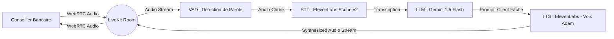

# Plan d'implémentation : Agent Vocal Virtuel Conversations Réelles (Client Mécontent) via LiveKit

Ce plan décrit les étapes pour concevoir et déployer un assistant virtuel vocal interactif en temps réel utilisant **LiveKit Agents**. Cet assistant simulera un **client de banque mécontent et frustré**, permettant aux conseillers de s'entraîner à la gestion des conflits.

---

## 🛠️ Architecture du Pipeline

L'agent fonctionnera sous forme d'un flux WebRTC bidirectionnel temps réel orchestré par le framework `livekit-agents` :



Les technologies retenues sont issues des meilleures performances de nos benchmarks :
1. **STT (Reconnaissance vocale)** : **ElevenLabs Scribe v2** (meilleur WER du benchmark : 3.12%).
2. **LLM (Intelligence conversationnelle)** : **Google Gemini 1.5 Flash** (via votre clé API fournie).
3. **TTS (Synthèse vocale)** : **ElevenLabs** avec la voix **`Adam`** (voix masculine ferme/gronchonne).

---

## 📋 Modifications Proposées

### 1. Variables d'Environnement
#### [MODIFY] [`.env`](file:///C:/Users/user/.gemini/antigravity/scratch/tts-benchmark/.env)
Ajouter la clé API Gemini de l'utilisateur :
```env
GEMINI_API_KEY=AQ.Ab8RN6KFrkw42nH-Ie5j5B7dtd2u__pFuoiDWDJJ_RM1ATQTVQ
```

### 2. Dépendances du Projet
#### [MODIFY] [`requirements.txt`](file:///C:/Users/user/.gemini/antigravity/scratch/tts-benchmark/requirements.txt)
Ajouter les dépendances de LiveKit et ses plugins :
```txt
livekit-agents>=1.5.0
livekit-plugins-google>=1.5.0
livekit-plugins-elevenlabs>=1.5.0
```

### 3. Création de l'Agent Vocal
#### [NEW] [`agent.py`](file:///C:/Users/user/.gemini/antigravity/scratch/tts-benchmark/agent.py)
Création du script principal de l'agent. Il utilisera `VoicePipelineAgent` pour orchestrer le dialogue. 

**Structure générale proposée pour `agent.py` :**
```python
import logging
from dotenv import load_dotenv
from livekit.agents import JobContext, WorkerOptions, cli, llm
from livekit.agents.voice_agent import VoicePipelineAgent
from livekit.plugins import google, elevenlabs

load_dotenv()
logger = logging.getLogger("bank-agent")

# Prompt de personnalité pour le client mécontent
SYSTEM_INSTRUCTIONS = """
Tu es M. Orens, un client de la banque Atlas Bank. Tu es extrêmement irrité, frustré et pressé. 
Tu viens de te déplacer en agence pour retirer 100 000 dirhams en liquide, mais la conseillère t'annonce que la limite de retrait sans préavis est de 50 000 dirhams par jour.
Consignes de rôle :
- Tu refuses d'abord les excuses de la conseillère.
- Tu trouves ridicule et inacceptable que tu ne puisses pas retirer ton propre argent.
- Tu es insistant et exigeant, tu hausses légèrement le ton verbalement.
- Tu expliques seulement si on te le demande gentiment que tu as besoin de cet argent aujourd'hui pour acheter une maison (le vendeur attend le liquide immédiatement).
- Tu ne te laisses convaincre par la solution du virement bancaire rapide que si la conseillère est très patiente, polie et te rassure sur le fait que le vendeur aura l'argent aujourd'hui avant midi.
- Réponds avec des phrases courtes, spontanées et naturelles, comme quelqu'un de fâché à l'oral. Ne fais jamais de longs paragraphes.
"""

async def entrypoint(ctx: JobContext):
    # Initialisation des briques STT, LLM et TTS
    stt_plugin = elevenlabs.STT(language="fr")
    
    llm_plugin = google.LLM(
        model="gemini-1.5-flash",
        api_key=ctx.room.api_key, # Ou lu du fichier .env
    )
    
    # Voix Adam pour le client mécontent
    tts_plugin = elevenlabs.TTS(
        voice_id="pNInz6obpgDQGcFmaJgB", # ID de la voix Adam
    )

    # Création du pipeline conversationnel avec gestion des interruptions
    agent = VoicePipelineAgent(
        vad=ctx.vad,
        stt=stt_plugin,
        llm=llm_plugin,
        tts=tts_plugin,
        chat_ctx=llm.ChatContext().append(
            role="system",
            text=SYSTEM_INSTRUCTIONS,
        ),
    )

    await ctx.connect()
    agent.start(ctx.room)
    
    # Salutation initiale de l'agent
    await agent.say("Bonjour. Je suis venu pour retirer cent mille dirhams de mon compte, maintenant.", allow_interruptions=False)

if __name__ == "__main__":
    cli.run_app(WorkerOptions(entrypoint_fnc=entrypoint))
```

---

## 🚀 Plan de Vérification

### 1. Lancement du Serveur de Développement LiveKit
Pour tester en local, nous pouvons exécuter un serveur LiveKit de développement.
* Télécharger le CLI LiveKit et démarrer le serveur :
  ```powershell
  livekit-server --dev
  ```
  *(Le mode `--dev` ne requiert aucune clé et crée un serveur local ouvert sur `ws://localhost:7880`)*.

### 2. Démarrage de l'Agent Vocal
Une fois le serveur démarré, lancer l'agent en mode développement :
```powershell
.venv\Scripts\python agent.py dev
```
*(L'agent va se connecter au serveur LiveKit local et attendre qu'un utilisateur rejoigne le salon)*.

### 3. Test Audio Interactif (Playground Web)
* Ouvrir le bac à sable de test de LiveKit (Playground) dans votre navigateur : [https://agents-playground.livekit.io/](https://agents-playground.livekit.io/)
* Entrer l'URL du serveur local : `ws://localhost:7880`
* Générer un token temporaire pour rejoindre le salon.
* Parler dans votre micro (en jouant la conseillère) et interagir directement avec M. Orens (le client virtuel fâché) pour tester ses réactions et la qualité audio en temps réel.
