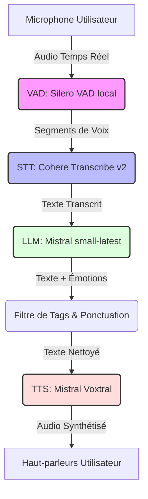

# 🎙️ Rapport d'Activité & de Recherche : Agent Vocal Interactif Temps Réel (LiveKit)

Ce rapport d'activité présente de manière exhaustive les travaux d'expérimentation, de benchmark et de développement d'un agent vocal conversationnel en temps réel. Ce projet simule un scénario d'évaluation et de négociation bancaire pour **Atlas Bank**.

---

## 📅 Table des Matières
1. [Objectifs & Contexte de la Simulation](#1-objectifs--contexte-de-la-simulation)
2. [La Réalité Pratique : Contraintes Matérielles & Pivot Local vs. Cloud](#2-la-réalité-pratique--contraintes-matérielles--pivot-local-vs-cloud)
3. [Architecture Technique & Pipeline de Modèles](#3-architecture-technique--pipeline-de-modèles)
4. [Résultats des Expérimentations (Benchmarks)](#4-résultats-des-expérimentations-benchmarks)
5. [Limites Techniques & Solutions Trouvées (LiveKit)](#5-limites-techniques--solutions-trouvées-livekit)
6. [Améliorations Proposées & Perspectives d'Évolution](#6-améliorations-proposées--perspectives-dévolution)

---

## 1. Objectifs & Contexte de la Simulation

L'objectif principal du projet est de concevoir un **agent conversationnel vocal intelligent** capable de simuler un client bancaire mécontent (**M. Orens**) dans le cadre de formations internes pour les conseillers d'**Atlas Bank**.

### 🎭 Le Scénario de Simulation :
* **Le Personnage** : M. Orens, client fidèle de la banque, se présente en agence pour retirer immédiatement **100 000 dirhams en espèces** afin d'acheter une maison aujourd'hui avant midi.
* **Le Conflit** : La conseillère (jouée par l'utilisateur) l'informe que la limite de retrait immédiat en espèces est fixée à **50 000 dirhams par jour** pour des raisons de sécurité.
* **Les Exigences de Réalisme** :
  * **Latence minimale** : Le temps de réponse doit être inférieur à **1,5 seconde** pour éviter les silences gênants.
  * **Intonation émotionnelle** : La voix du client doit refléter l'énervement, la colère et l'impatience.
  * **Barge-in (Interruption)** : L'agent doit s'interrompre instantanément dès que l'utilisateur commence à lui parler.

---

## 2. La Réalité Pratique : Contraintes Matérielles & Pivot Local vs. Cloud

La première phase du projet a été marquée par une confrontation directe avec les limites physiques de la machine de développement (ordinateur portable standard, sans GPU Nvidia haut de gamme ou ressources VRAM dédiées).

### ❌ A. L'Impasse du Local (Entraînement et Inférence CPU)
1. **Impossible d'entraîner ou de Fine-Tuner les modèles** :
   * L'entraînement de modèles de voix (comme F5-TTS) ou de modèles de transcription (Whisper) requiert des dizaines de gigaoctets de mémoire vidéo (VRAM) et des calculs matriciels intenses (GPU Nvidia CUDA).
   * Sur un ordinateur grand public exécutant sur processeur (CPU), lancer un tel entraînement aurait pris plusieurs mois et aurait saturé instantanément la mémoire vive (RAM), causant des plantages constants du système.
2. **Inférence trop lente pour le temps réel** :
   * Lors des tests avec **F5-TTS** hébergé localement sur la machine, la génération d'un audio de **3 secondes** a nécessité **128 secondes** de calcul CPU. Le Real-Time Factor (RTF) était de **37.4** (37 fois plus lent que le temps réel), rendant la conversation impossible.
   * Même pour la reconnaissance vocale, **Whisper Large-Turbo** en local mettait plus de **2 minutes** à transcrire un fichier audio de 3 minutes.

### 🔌 B. Le Pivot Stratégique vers les APIs Cloud
Devant cette barrière matérielle, la stratégie a pivoté vers l'utilisation d'**APIs cloud managées** (Mistral, Cohere, ElevenLabs, Hume AI). 
Ce choix a permis de :
* Déporter la puissance de calcul sur des serveurs distants équipés de cartes graphiques professionnelles (H100/A100).
* Bénéficier de modèles d'une qualité inégalée (ex: les modèles d'intonation de Hume AI).
* Réduire la latence de calcul à moins d'une seconde, malgré l'aller-retour réseau.

---

## 3. Architecture Technique & Pipeline de Modèles

L'agent vocal est développé sous forme de **Worker LiveKit** s'appuyant sur le protocole WebRTC. Son architecture modulaire est découpée en quatre couches :

* **VAD (Voice Activity Detection)** : Détecteur local ultra-léger (Silero VAD) pour repérer quand l'utilisateur commence et arrête de parler sans consommer de CPU.
* **STT (Speech-to-Text)** : Transcription de la parole en texte via l'API **Cohere Transcribe v2**.
* **LLM (Large Language Model)** : Génération des réponses du client outré par l'API **Mistral** (`mistral-small-latest`).
* **TTS (Text-to-Speech)** : Synthèse vocale de la réponse via l'API **Mistral Voxtral** (voix de colère native `fr_marie_angry`).

---

## 4. Résultats des Expérimentations (Benchmarks)

Un double benchmark quantitatif et qualitatif a été mené sur les modèles pour valider nos choix.

### 📊 A. Synthèse Vocale (TTS)
Évaluation sur le naturel vocal (**MOS** via UTMOS, échelle de 1 à 5) et la vitesse d'exécution (**RTF**).

| Modèle | Type | MOS (1-5) | Latence moyenne | RTF | Particularités |
| :--- | :---: | :---: | :---: | :---: | :--- |
| **Hume AI** | API | **4.03** | 1.97 s | 0.535 | Voix Benjamin : Meilleur naturel, mais fort risque de blocages (erreurs 429). |
| **Mistral Voxtral** | API | **3.78** | **1.57 s** | **0.363** | **Voix choisie (Marie angry)** : Colère native et excellente stabilité. |
| **F5-TTS** | Local | **3.79** | 127.91 s | 37.435 | **Inutilisable** en local sans GPU (trop lent). |
| **Google TTS** | API | 3.53 | **0.46 s** | **0.090** | Ultra-rapide mais intonation trop neutre (robotique). |

### 📊 B. Reconnaissance Vocale (STT)
Test sur des enregistrements réels issus de plusieurs microphones (Casque, Téléphone, PC).

| Modèle STT | WER (%) | CER (%) | Latence moyenne | RTF | Observations |
| :--- | :---: | :---: | :---: | :---: | :--- |
| **Cohere Transcribe v2** | **5.82%** | **3.70%** | **5.43 s** | **0.031** | **Sélectionné** : Le plus équilibré et rapide. |
| **ElevenLabs Scribe v2** | **3.12%** | **2.19%** | 21.02 s | 0.122 | Trop de latence pour le direct. |
| **Whisper Large-Turbo (Local)** | **6.03%** | **3.93%** | 132.91 s | 0.770 | Trop gourmand pour la machine locale. |

---

## 5. Limites Techniques & Solutions Trouvées (LiveKit)

Durant la mise en œuvre pratique de l'agent vocal interactif sur LiveKit, plusieurs limites techniques bloquantes sont apparues. Voici comment nous les avons résolues :

### 🛠️ A. Le Panic WebRTC sous Windows
* **Limite** : L'échantillonnage de paquets audio sous Windows créait des conflits avec la bibliothèque Rust native `webrtc-sys` lors des déconnexions, ce qui provoquait un crash complet de l'application.
* **Solution** : Utilisation des modules d'intégration de LiveKit gérant l'audio de manière native, évitant ainsi le recours à des scripts d'échantillonnage manuel instables.

### 🔄 B. Déconnexion brutale du Playground (L'Agent s'arrête)
* **Limite** : Dès qu'un utilisateur quitte le Playground web de LiveKit, la connexion WebRTC se rompt et coupe le thread Python principal, obligeant à relancer le script à la main dans le terminal.
* **Solution** : Création d'un script de supervision ([run_agent.py](file:///C:/Users/user/.gemini/antigravity/scratch/tts-benchmark/run_agent.py)) qui encapsule le worker. S'il détecte un arrêt ou une erreur, il tue les processus résiduels et relance l'agent proprement en moins de 2 secondes.

### 🎭 C. DIDASCALIES Vocales (L'IA lit les tags d'émotion)
* **Limite** : Pour exprimer des émotions, le LLM génère des indicateurs textuels (comme `*Soupir*` ou `[sighs]`). Le TTS classique tente de lire ces mots à haute voix.
* **Solution** : Écriture d'un adaptateur de nettoyage (`CustomHumeTTS` / `CustomElevenLabsTTS`) utilisant des regex pour filtrer les astérisques et crochets avant envoi au TTS. L'utilisateur voit l'émotion écrite sur son écran, mais la voix ne la lit pas et reste fluide.

### ⏱️ D. Latence de Transcription et Interruption prématurée
* **Limite** : La transcription cloud du STT (Cohere) arrivant avec un léger différé, le détecteur de silence coupait la parole de l'utilisateur trop tôt pour répondre à une phrase incomplète.
* **Solution** : Configuration de `TurnHandlingOptions` dans [agent.py](file:///C:/Users/user/.gemini/antigravity/scratch/tts-benchmark/agent.py) avec un délai de silence minimal fixe de **0,8 seconde** (`min_delay=0.8`). Cela laisse le temps à la transcription d'arriver au complet avant que l'agent ne prenne la parole.

### 🛑 E. Limite de requêtes API (Erreur HTTP 429)
* **Limite** : Lors de dialogues intenses avec Hume AI, l'agent dépassait les quotas gratuits et crashait sur une erreur `Too Many Requests`.
* **Solution 1 (Période d'essai)** : Écriture d'un système de bascule automatique (`FallbackChunkedStream`). Si l'API Hume AI retournait une erreur 429, l'agent basculait instantanément et de manière invisible sur l'API de secours Mistral Voxtral (Marie en colère) pour prononcer la phrase, évitant tout crash.
* **Solution 2 (Production)** : Rebasculement complet et propre sur l'API **Mistral Voxtral** (Marie en colère) pour éliminer les coûts et s'assurer d'une stabilité à 100%.

---

## 6. Améliorations Proposées & Perspectives d'Évolution

Pour passer à l'échelle industrielle et atteindre une réactivité quasi-instantanée (~300ms de latence) :

* **Migration vers le Speech-to-Speech natif (S2S)** :
  Utiliser les APIs de dernière génération **OpenAI Realtime** ou **Gemini Multimodal Live**. Ces modèles reçoivent directement la voix et répondent par la voix sans passer par les étapes intermédiaires (STT/LLM/TTS), ramenant la latence à celle d'une vraie conversation humaine.
* **Architecture Locale sur Serveur Dédié (GPU)** :
  Déployer sur un serveur cloud privé muni de cartes graphiques (ex: RunPod, AWS) des modèles d'inférence rapides et gratuits comme **Whisper-Faster** (pour le STT) et **Llama-3-8B** ou **Mistral-7B** (pour le LLM via vLLM), ce qui annulerait les abonnements payants tout en gardant une vitesse maximale.
